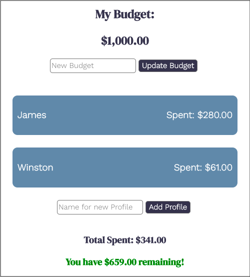
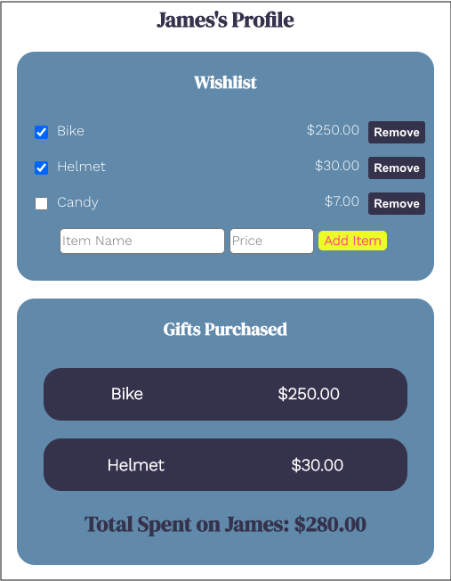

# iGift

Link to live app: https://igift-app.vercel.app/

## Summary of App

iGift is designed to help consumers track their holiday gift-spending. 

After creating an account and logging in, the user will first set their budget. They will have the option to go back and adjust this budget whenever they want.

Then, the user can create a profile for each person on their shopping list. The list of the user's profiles will be shown on the main budget page, and clicking on a profile will take the user to the profile's page. 

Screenshot of the main budget page:

Each profile's page includes a 'Wishlist' section where the user can add or remove gift items and their prices, and a 'Gifts Purchased' section that lists each of the gifts that have been purchased along with their costs. When a user purchases an item on their wishlist, they can check the box next to that item and it will be added to the 'Gifts Purchased' section below. The total spent on each person will be shown at the bottom of their profile.

Screenshot of a profile page:

As more gifts are purchased, the cost of each gift will be deducted from the user's budget. At the bottom of the main budget page the user can see how much they have spent, as well as how much of their budget remains. 

## Technology Used

### Frontend

- HTML
- CSS
- Javascript
- React
- Hosted on Vercel

### Backend

- Node.js
- PostgreSql
- Hosted on Heroku

